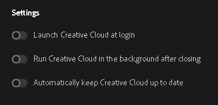

# Adobe Free Guide

A guide on how to install Adobe applications for free.

## Contents

1. **Introduction**
   - Overview of Adobe applications.
2. **System Requirements**
   - Necessary hardware and software requirements.
3. **Installation Guide**
   - Step-by-step instructions for installing each application.
4. **Frequently Asked Questions**
   - Answers to common questions.

## Introduction

### What is Adobe?
Adobe Inc. is a globally recognized software company that specializes in multimedia and creativity software products. It is renowned for its innovative tools that empower individuals and businesses to design, create, and communicate visually.

### Popular Adobe Applications
Here are some of Adobe's most famous applications:

- **Adobe Photoshop**: A powerful image editing and graphic design software.
- **Adobe Illustrator**: A vector graphics editor used for creating illustrations, logos, and artwork.
- **Adobe Premiere Pro**: A professional video editing software.
- **Adobe After Effects**: A tool for motion graphics and visual effects.
- **Adobe Acrobat**: A software for creating, editing, and managing PDF documents.
- **Adobe Lightroom**: A photo editing and organization tool for photographers.

These applications are widely used across industries such as graphic design, video production, photography, and digital marketing.

## Important Warning About GenP

### What is GenP?
GenP, short for "Generic Patcher," is a tool designed to extend the trial periods of Adobe Creative Cloud software on Windows systems. It modifies certain system files to reset the trial timer, effectively allowing users to use Adobe applications like Photoshop and Premiere Pro without a valid subscription.

### Legal and Security Risks

While GenP is often promoted as an educational or research tool, using it comes with significant risks:

#### Legal Risks
- Utilizing software like GenP to bypass copyright protections and avoid paying for licenses constitutes software piracy. This is illegal in most countries, including Vietnam.

#### Security Risks
- Downloading and running executable files (.exe) from unofficial sources, especially cracking tools, is one of the most common ways computers become infected with malware, viruses, trojans, or ransomware.
- These tools often require administrative privileges and may even ask you to disable antivirus software to function. This creates a significant security vulnerability, potentially allowing malicious software to gain full control of your system, steal personal information, passwords, or financial data.

### Disclaimer
This guide does not endorse or encourage the use of tools like GenP. It is provided solely for educational purposes to raise awareness about the associated risks.

## Getting Started

Follow the steps in this guide to easily and safely install Adobe applications for free.

## Step-by-Step Guide

### Phase 1: Preparation and Thorough Uninstallation

The goal of this phase is to ensure your computer is completely "clean" of any old Adobe versions to avoid conflicts during installation.

#### Uninstall All Adobe Applications

Before proceeding, make sure to uninstall all existing Adobe applications (such as Photoshop, Illustrator, Premiere, and especially Adobe Creative Cloud) from your computer.

- Use your preferred uninstallation method (e.g., via Windows "Apps & features" or specialized uninstallation tools) to ensure all leftover files and registry keys are thoroughly removed.

#### Download Required Tools

Download the necessary files mentioned in this guide to proceed with the installation.

### Installation Requirements

#### Adobe Creative Cloud
- Download the official Adobe Creative Cloud application from the [Adobe Creative Cloud](https://www.adobe.com/download/creative-cloud).

#### GenP
- Download GenP (GP) from its official source: [GenP](https://gen.paramore.su/).

### Phase 2: Installing Creative Cloud (CC)

Now you will install Adobe's main management tool.

#### Steps:
1. Run the "Creative Cloud" installer.
2. Click "Continue" and log in using your account (Gmail/Adobe).
3. **Important Note**: During the installation process, if a popup window appears, make sure to uncheck the box for Adobe Genuine Service (AGS) before proceeding.
4. Wait for Creative Cloud to finish installing.

### Phase 3: Configuration and Activation Preparation

Before activation, you need to configure Creative Cloud (CC) and disable your antivirus software.

#### Configure Creative Cloud:
1. Open the Creative Cloud application you just installed.
2. Click on the menu (three-dot icon) -> File -> Reference.
3. Turn off all three settings:
   - Launch Creative Cloud at login
   - Run Creative Cloud in the background after closing
   - Automatically keep Creative Cloud up to date
   - Refer to the image below for reference:

   

4. Click "Done."
5. Go back to File -> Quit to ensure the application is completely closed.

#### Disable Antivirus (Important):
1. Open "Windows Security."
2. Navigate to "Virus & threat protection" -> "Manage settings."
3. Temporarily turn **Off** the "Real-time protection" option. 
   - This step ensures that the "GB" tool is not blocked during the process.

### Phase 4: Activation (Using Adobe GB)

This is the software "cracking" step.

#### Steps:

1. **Extract and Run Adobe GB**:
   - Extract the "Adobe GB" file.
   - Right-click on the executable and select "Run as administrator."

2. **Activate Creative Cloud**:
   - **Note**: If you installed the application in a custom directory, make sure to patch accordingly. If you used the default directory, no additional steps are needed.
   - In the "GB" tool, click the "Search" button.
   - Once the scan is complete, click the "P" (Patch) button to bypass the payment requirement.

3. **Install Applications**:
   - Open Creative Cloud.
   - Navigate to the "App" section and select the application you want to install (e.g., Photoshop), then click "Install."
   - Wait for the application to finish installing.

4. **Activate Applications (Second Time)**:
   - After the application (e.g., Photoshop) is installed, close Creative Cloud.
   - Reopen the "Adobe GB" tool (Run as administrator).
   - **Note**: If you installed the application in a custom directory, make sure to patch accordingly. If you used the default directory, no additional steps are needed.
   - Click "Search" again to detect the newly installed application.
   
   - Click the "P" (Patch) button to activate the specific application.

### Phase 5: Blocking Internet Connection

The final step is to prevent the application from connecting to Adobe's servers.

#### Steps:

1. **Use Adobe GB's Popup Tool**:
   - Open the "Adobe GB" tool and switch to the "Popup tool" tab.
   - Locate the second option (referred to as "File one" in the video, possibly "Firewall").

2. **Add Firewall Rules**:
   - Click the "Add rule" button.
   - Select "Select all" and then click "OK."

3. **Complete the Process**:
   - You can now re-enable your antivirus software (**Real-time protection**) that was disabled in Phase 3.

---

## Frequently Asked Questions

### 1. Is this guide legal?
- This guide is for **educational purposes only**. Using GenP or similar tools may violate Adobe's terms of service and is considered illegal in many jurisdictions.

### 2. Will I get caught using GenP?
- There is always a risk when using software cracking tools. Not only could you face **legal consequences**, but these tools often come with **malware** or other security risks.

### 3. Can I update my Adobe applications after using GenP?
- Updating may reverse the changes made by GenP, potentially requiring you to repeat the process. However, this is not guaranteed, and updates may also introduce new security vulnerabilities.

### 4. What should I do if I encounter an error?
- Double-check each step to ensure everything was done correctly. If problems persist, consider seeking help from **forums or communities** familiar with Adobe software.

### 5. Is there an alternative to using GenP?
- The safest alternative is to purchase a **legitimate license** for Adobe software. This supports the developers and ensures you receive updates and support.